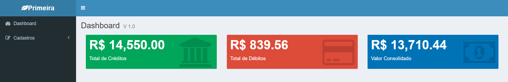
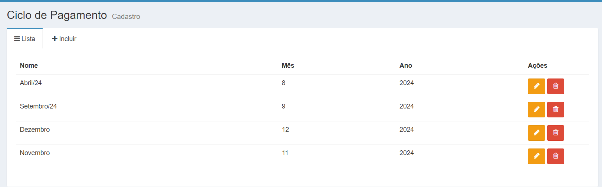
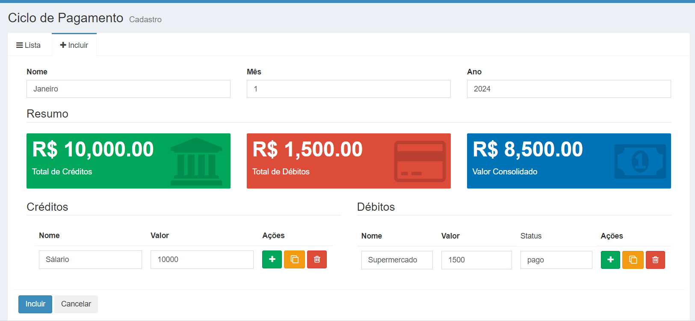

# MEAN
Neste projeto, utilizamos uma stack moderna e eficiente para o desenvolvimento da aplicação, composta pelas seguintes tecnologias:

AngularJS: Um framework JavaScript poderoso para criar interfaces dinâmicas e interativas. Com ele, desenvolvemos uma aplicação de página única (SPA), proporcionando uma experiência de usuário fluida e sem recarregamento de páginas.

Node.js: Plataforma que permite a execução de JavaScript no lado do servidor. Foi utilizada para criar o servidor que processa as requisições dos usuários e lida com a lógica de negócios da aplicação.

MongoDB: Um banco de dados NoSQL flexível e escalável, orientado a documentos JSON, ideal para armazenar dados com estruturas variáveis, permitindo a gestão eficiente das informações.

Express: Um framework minimalista para Node.js, utilizado para gerenciar requisições HTTP e conectar o front-end ao banco de dados, garantindo uma comunicação fluida entre as diferentes camadas da aplicação.

Essa combinação, conhecida como MEAN stack, permite o desenvolvimento completo, do back-end ao front-end, usando JavaScript em todas as etapas.

Alguma imagem do projeto

Tela de DASBOARD

Exibição da lista de cadastro
 
Tela de Cadastro

#Inicializar o Backend
Npm run production

#TECNOLOGIAS UTILIZADAS NO DESENVOLVIMENTO DO PROJETO

# 💻 Tech Stack:
      

<!-- Proudly created with GPRM ( https://gprm.itsvg.in ) -->